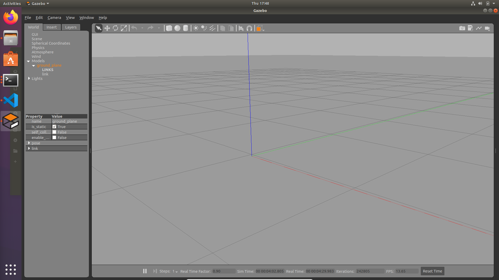

# ROS2 mycobot280m5 Gazebo适配

## 1. 环境配置

本项目选用`Ubuntu22.04`及其对应的`ROS2-Humble`版本，具体的安装流程可参照[大象机器人官网的安装指南](https://docs.elephantrobotics.com/docs/gitbook/12-ApplicationBaseROS/12.2-ROS2/12.2.1-ROS2%E7%9A%84%E5%AE%89%E8%A3%85.html)。按照流程安装完成后可以根据[机械臂控制](https://docs.elephantrobotics.com/docs/gitbook/12-ApplicationBaseROS/12.2-ROS2/12.2.4-rviz%E4%BB%8B%E7%BB%8D%E5%8F%8A%E4%BD%BF%E7%94%A8/myCobot-280.html)的内容验证是否正确完成了安装和配置的工作。

此外我们还需要安装`Gazebo`和`MoveIt`（官网上面提供的MoveIt2安装不够全面，由于我们要适配Gazebo，还需要除MoveIt2本身以外的一些工具）

**安装Gazebo**

```bash
sudo apt install gazebo
sudo apt install ros-humble-gazebo-*
```

**安装moveit-setup-assistant**

```bash
sudo apt install ros-humble-moveit-setup-assistant
```

**安装MoveIt2其它组件**

```bash
sudo apt install ros-humble-moveit-*
```

在终端命令行输入命令`gazebo`验证gazebo是否下载配置好，如果安装配置一切正常，你将会看到如下的界面



## 2. 使用

在终端命令行进入ROS2的工作环境

```bash
cd ~/colcon_ws
```

### 2.1 滑块控制

在终端输入

```bash
ros2 launch mycobot_280_gazebo_moveit slider_control_gazebo.launch.py
```

你将会看到如下的界面


此时你就可以通过拖动滑块来操控机械臂模型各关节的位姿了

### 2.2 模型跟随

在终端输入

```bash
ros2 launch mycobot_280_gazebo_moveit follow_display_gazebo.launch.py
```

Gazebo将会加载280m5机械臂模型并且你可以通过操控实际机械臂的位姿来实现Gazebo中机械臂模型位姿的联动

需要注意的是，你需要先确认机械臂是否已经连好并且能被当前计算机所识别，在Ubuntu中，可以通过指令`ls /dev/tty*`来进行查找，如果搜索不到诸如

`/dev/ttyACM0, /dev/ttyACM1, /dev/ttyUSB0, /dev/ttyUSB1`这样的端口，首先考虑是不是虚拟机的USB未开启。为了解决这个问题，可以先关闭虚拟机，然后在设置中找到`USB设备`，并勾选`启用USB控制器`选项，选择`USB 3.0`，并点击右侧第二个按钮添加280m5机械臂对应的USB设备

这里还有可能遇到`Permission Denied`的问题，以/dev/ttyACM0这个端口为例，需要输入以下这行命令

```bash
sudo chmod 777 /dev/ttyACM0
```

如果端口是其它名字，直接进行替换即可。这样就可以实现Gazebo机械臂模型的跟随了

### 2.3 键盘控制

你还可以使用键盘输入的方式同时操控Gazebo中机械臂模型的位姿，首先打开一个终端并输入

```bash
ros2 launch mycobot_280_gazebo_moveit teleop_keyboard_gazebo.launch.py
```

这时将会弹出Gazebo界面以及机械臂模型，然后打开第二个终端并输入

```bash
cd ~/colcon_ws/src/mycobot_ros2/mycobot_280/mycobot_280_gazebo_moveit/mycobot_280_gazebo_moveit
python3 teleop_keyboard.py
```

你将会在终端看到输出

```bash
Mycobot_280_m5 Teleop Keyboard Controller

---------------------------

Movimg options (control the angle of each joint):

    w: joint2_to_joint1++   s: joint2_to_joint1--

    e: joint3_to_joint2++   d: joint3_to_joint2--

    r: joint4_to_joint3++   f: joint4_to_joint3--

    t: joint5_to_joint4++   g: joint5_to_joint4--

    y: joint6_to_joint5++   h: joint6_to_joint5--

    u: joint6output_to_joint6++ j: joint6output_to_joint6--


Other:

    1 - Go to init pose

    2 - Go to home pose

    3 - Resave home pose

    q - Quit
```

这时你就可以根据上面的提示来通过键盘输入操作机械臂了，注意这个终端需要实时读取你的键盘输入，因此请将这个终端切换到最前（在键盘输入之前用鼠标点击一下终端），这样就可以实现通过键盘输入来控制机械臂模型了